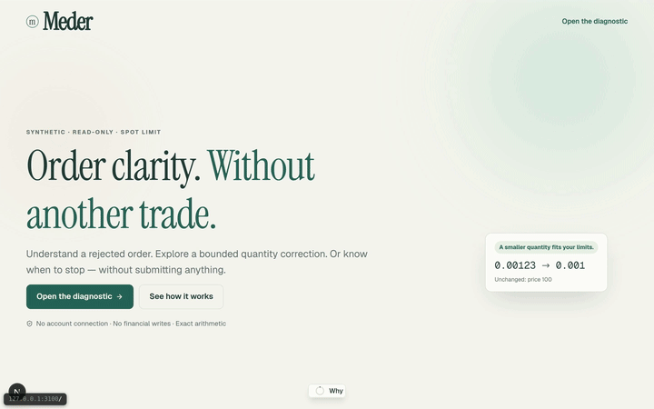
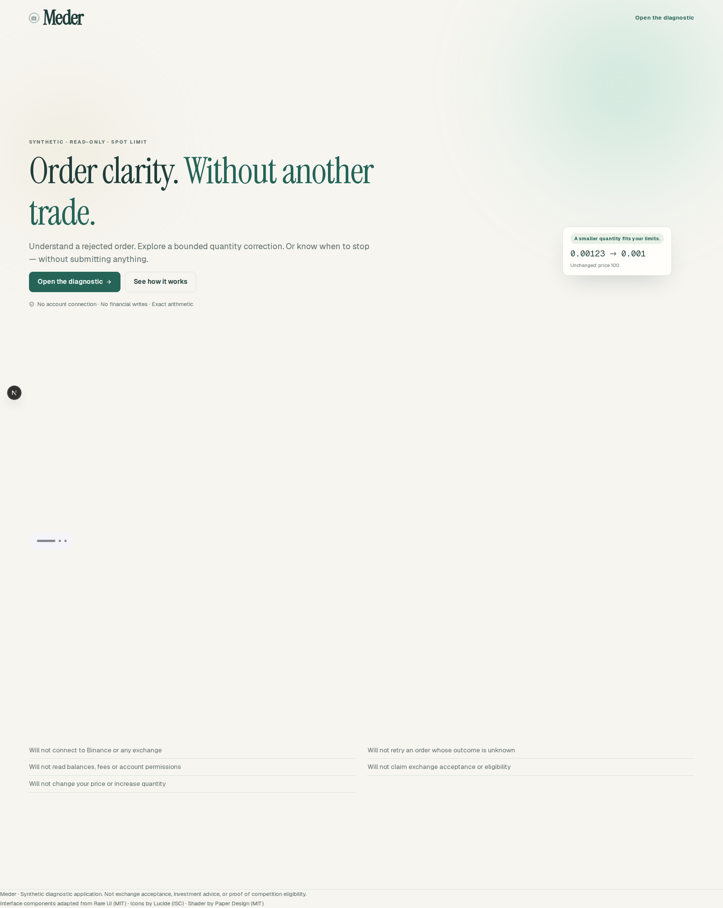
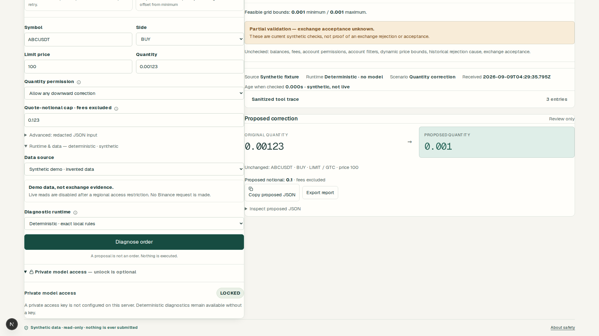
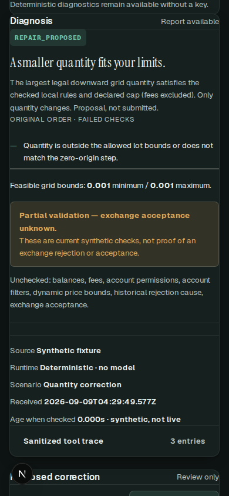

# Meder — order clarity, without another trade

**Meder** is a read-only, synthetic-only diagnostic for Spot `LIMIT`/`GTC`
orders. It checks an order against Binance-style filter rules (LOT_SIZE,
PRICE_FILTER, MIN_NOTIONAL, NOTIONAL) with exact BigInt/rational arithmetic,
and can propose the single explicitly permitted correction: a downward BUY
quantity reduction. It never executes, retries, signs, or looks up an order;
it has no exchange credentials and no account access. All results are partial
validation, not exchange acceptance, and the notional cap excludes fees.

The user reported submitting this project to the Binance Agent OS Mini
Hackathon at `2026-09-08T23:59:39.346Z`. Receipt, eligibility, acceptance, and
the exact submitted payload remain **unverified**. Model capability is
unconfigured; no genuine model run or live exchange data has been verified.

## See it

A short capture of the real flow — landing → open the diagnostic → run the
synthetic fixture → verdict:



Full-quality recording: [`docs/media/meder-demo.webm`](docs/media/meder-demo.webm)

| Landing | Tool (result, light) | Tool (result, mobile dark) |
| --- | --- | --- |
|  |  |  |

Screenshots were captured from the running app; the demo recording is a
verified capture of the current build, not an archived or simulated clip.

## Repository layout

| Path | What it is |
| --- | --- |
| `apps/meder` | The independent Next.js application — the product. Routes: `/` landing page, `/app` the diagnostic tool, `/meder` permanent redirect to `/app` |
| `docs/meder/` | Product manifest, specification, runbook, submission handoff, UI-refactor audit and design docs |
| `docs/*.md`, `track-a-agent-os-standalone.md` | Research and original blueprints (pre-product) |
| `scripts/` + `tests/` | Python document reader (port 3001) and its tests — a separate research tool, not a solver |
| `.github/workflows/meder.yml` | Hosted verification: reader tests, typecheck, Node tests, build, Playwright suite on Bun |

## Stack (current)

Bun 1.3.1 is the package manager and script runner (`bun.lock` is the
lockfile); Next runs on Node 24 (`bun --bun next build` SIGILLs on Bun's
runtime, so Next is never executed under Bun). Pinned: Next.js 16.3.4,
React 19.2.8, TypeScript 5.9.3. Styling is Tailwind CSS v4 with a fluid
`clamp()` type scale and a full-viewport shell; interface components come
from Rare UI (MIT), icons from Lucide, motion from `motion/react`, and the
landing hero shader from `@paper-design/shaders-react` (WebGL, gated off for
small screens and reduced motion). Fonts are self-hosted via `next/font`.

## Run and verify Meder

```sh
cd apps/meder
bun install --frozen-lockfile
bun run dev          # http://localhost:3000 — landing at /, tool at /app
```

Verification gates (all run locally and in hosted CI):

```sh
bun run typecheck
bun run test         # 87 Node tests (tsx --test under Node 24)
bun run build        # production build; / and /app static, /meder redirect
bun audit            # 0 vulnerabilities
bun run test:browser # 21 Playwright tests (20 frozen contract + landing smoke)
```

CI runs the browser suite against the production artifact (`next start`), so
`CI=1` is not needed locally. Additional rendered-UI verification helpers
(documentation, screenshot matrix, axe, reduced-motion/CSP, copy-discipline,
rendered-UI and dead-CSS audits) are listed in
[`docs/meder/RUNBOOK.md`](docs/meder/RUNBOOK.md).

Current checkpoint: **87 Node tests, 21 browser tests, six reader tests,
typecheck, production build, and `bun audit` 0**, all green — hosted CI
included. Redesign specifics (awwwards-tier landing, dark theme, mobile
polish, copy discipline: no AI claims, no spend phrasing, no numerotation)
are recorded in [`docs/meder/ui-refactor/README.md`](docs/meder/ui-refactor/README.md).

## Live data and model access (honest bounds)

- **Synthetic mode only.** Live mode is disabled and locally returns HTTP 451
  without making a Binance request; there is no silent fallback. Do not evade
  it through another host or proxy.
- **Optional private model gate.** `apps/meder` can use OpenAI Responses via
  server-side `fetch` when `OPENAI_API_KEY`, `OPENAI_MODEL`, and a separate
  `MEDER_MODEL_ACCESS_KEY` are configured on the server and the browser
  session explicitly unlocks model access. Missing or invalid settings fail
  closed. This is a private-demo gate, not production authentication — do not
  expose a model-enabled instance publicly. Production also requires
  `MEDER_ALLOWED_ORIGIN` set to the exact served origin; an unset production
  origin fails closed.
- A single concurrent model run and a finite process-lifetime budget
  (`MEDER_MODEL_RUN_BUDGET`, default 10) apply; these are in-process
  safeguards, not authentication or a spend cap.

## Documentation index

- [Product/build manifest](docs/meder/MANIFEST.md)
- [Implementation specification](docs/meder/SPEC.md)
- [Prioritized TODO plan](docs/meder/TODO.md)
- [Machine-readable manifest](docs/meder/manifest.json)
- [Plan drift audit](docs/meder/PLAN-AUDIT.md)
- [Runbook](docs/meder/RUNBOOK.md)
- [Submission handoff and external gates](docs/meder/SUBMISSION.md)
- [UI/UX audit and redesign docs](docs/meder/ui-refactor/README.md)
- Research: [OrderMedic blueprint](docs/ordermedic-build-blueprint.md),
  [Agent Crash Lab blueprint](docs/agent-crash-lab-build-blueprint.md),
  [Track A guide](track-a-agent-os-standalone.md),
  [Track A ecosystem research](docs/track-a-five-ideas-ecosystem-research.md),
  [Track B research and concepts](docs/track-b-research-and-five-concepts.md)

## Document Preview (Python reader)

```sh
python3 -m venv .venv
.venv/bin/pip install -r requirements-preview.txt
.venv/bin/python scripts/docs_preview.py   # port 3001
.venv/bin/python -m unittest discover -s tests -v
```

The reader serves only allowlisted documents, sanitizes rendered HTML, and
has no trading or account integration. Its "Track A: old → new" view compares
the current guide with an older uploaded draft; that draft is a local-only
artifact excluded from Git, so on a fresh checkout the view renders a
placeholder instead of the old file.

## License

Released under the [MIT License](LICENSE). Interface components adapted from
Rare UI (MIT); icons by Lucide (ISC); landing shader by Paper Design (MIT).

Repository-owned Hoplite setup/run commands live in `.hoplite/settings.json`
(the managed Preview runs `apps/meder` on port 3000); project overrides, if
present, take precedence. Local proof artifacts, uploads, and dependencies
are excluded from Git via `.gitignore`.
